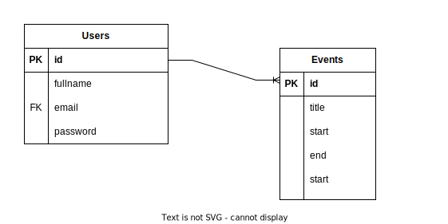

# Calendar

## List of Entities

### Users **(ED)**

- user_id **(PK)**
- fullname
- email **(UQ)**
- password

### Events **(ED|EC)**

- event_id **(PK)**
- notes
- title
- start
- end

## Relationships

1. A **User** has **Events** (_1 - M_).
1. A **User** generates **events** (_1 - M_).

## Diagrams

### Relational Model of the DB

## Business Rules

### User

1. Create a user.
1. Read all users.
1. Read a particular user.
1. Update a user.
1. Delete a user.

### Event

1. Create a event.
1. Read all events.
1. Read a particular event.
1. Update a event.
1. Delete a event.
